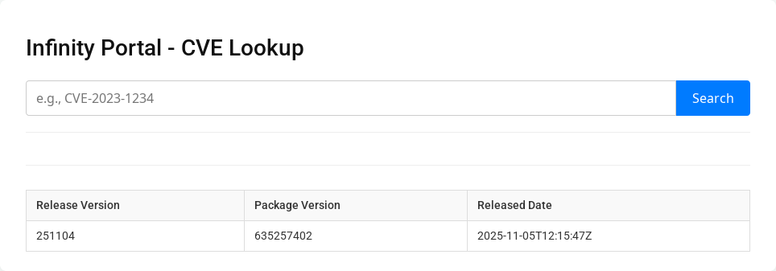

# Check Point CVE Search

This is a simple demo to search IPS Protections via the Infinity Portal using the IPS publications API. 
More information can be found in the following documentation:

* https://sc1.checkpoint.com/documents/Infinity_Portal/WebAdminGuides/EN/Infinity-Portal-Admin-Guide/Content/Topics-Infinity-Portal/API-Keys.htm
* https://support.checkpoint.com/results/sk/sk184153
* https://app.swaggerhub.com/apis-docs/Check-Point/infinity-portal-api

> **Warning:** I'm not a developer so a lot of help came from Google's Gemini. It's probably not the most securely developed tool.

## Screenshot

---

## Configuration

This application is configured entirely through environment variables. Before running the application, you **must** create a `.env` file in the root of the project.

1. Create your API key via the Infinity Portal. 
   * https://portal.checkpoint.com/dashboard/settings/api-keys

2.  Create a file named `.env` and add the following variables to the file, filling in your specific credentials:

    ```ini
    # --- .env file ---
    
    # The Infinity Portal tenant 
    REMOTE_API_BASE_URL=https://cloudinfra-gw.portal.checkpoint.com (or the proper tenant URL)
    
    # Your credentials for the remote API 
    INITIAL_CLIENT_ID=your-client-id-goes-here
    INITIAL_ACCESS_ID=your-access-key-goes-here
    ```
---

## Running the Application
### Method 1: Using Docker Compose

* Rename the `docker-compose.example.yml` to `docker-compose.yml`
* Build and run the container:
    *(This will automatically load the `.env` file and map port 8080)*
    ```bash
    docker-compose up -d
    ```
* To stop the application, run:
   ```bash
   docker-compose down
   ``` 

### Method 2: Running directly with Python

1. Clone the repository
2. Setup the python environment
```bash
user$ python -m venv venv
user$ . venv/bin/activate
(venv) user$ pip install -r requirements.txt
(venv) user$ python app.py
* Serving Flask app 'app'
 * Debug mode: off
WARNING: This is a development server. Do not use it in a production deployment. Use a production WSGI server instead.
 * Running on all addresses (0.0.0.0)
 * Running on http://127.0.0.1:8080
Press CTRL+C to quit
```

The application will now be running and accessible at `http://localhost:8080`.


